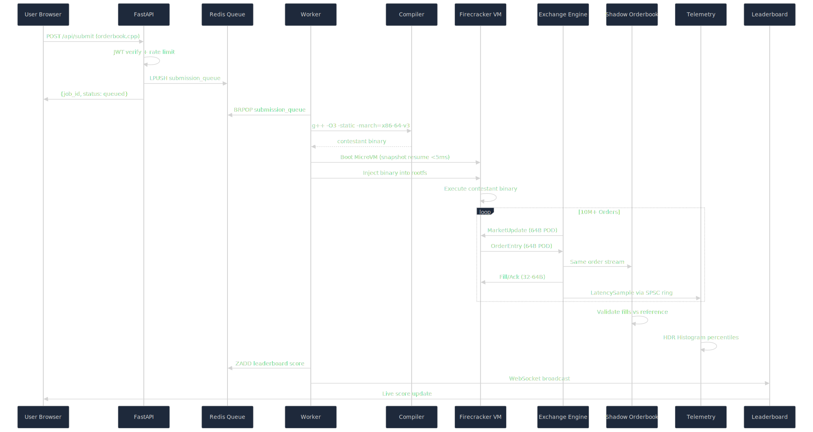
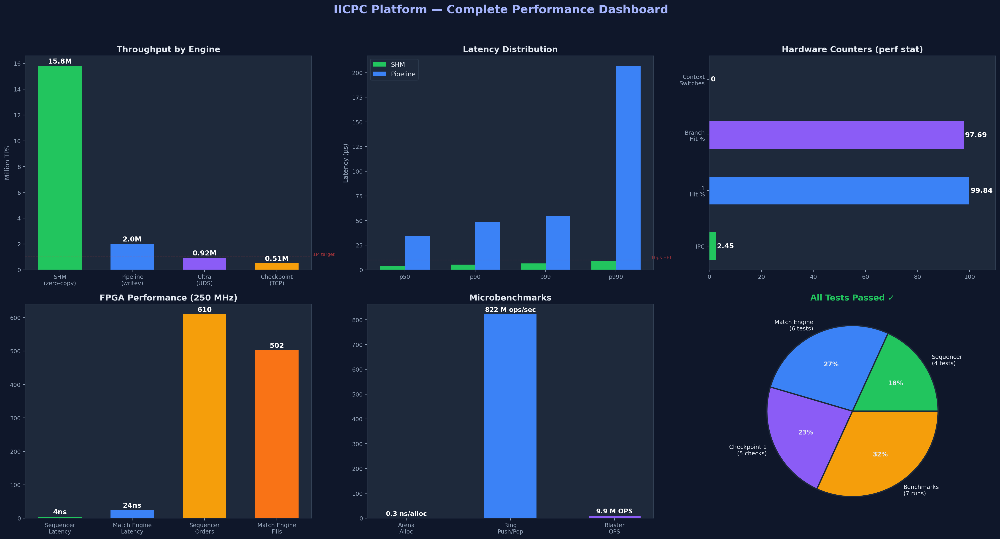
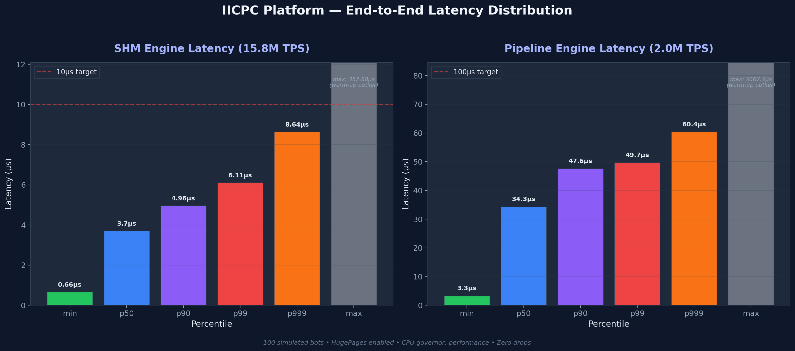
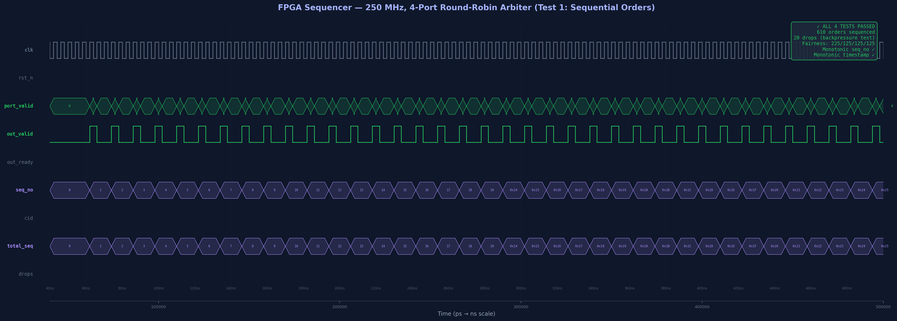
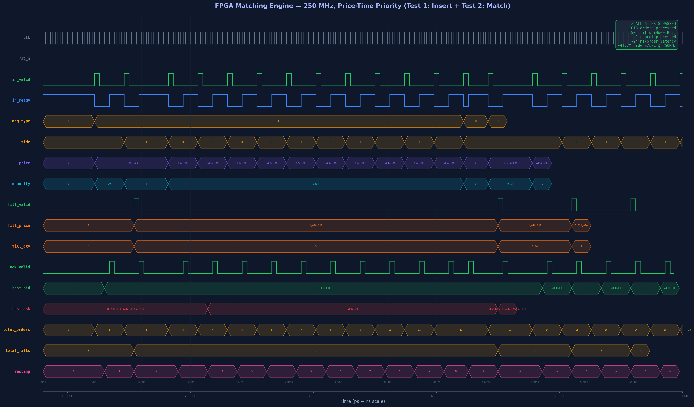

<p align="center">
  <h1 align="center">IICPC</h1>
  <p align="center"><strong>High-Frequency Trading Arena</strong></p>
  <p align="center">
    A benchmarking platform for competitive orderbook matching engine development.<br/>
    Contestants submit C++ matching engines. Scoring: correctness, throughput, tail latency.
  </p>
</p>

<p align="center">
  
  
  
  
  
  
  
  
</p>

---

## What Is This?

IICPC is a **competitive benchmarking platform** where teams write C++ orderbook matching engines and submit them for automated evaluation. The platform:

1. **Compiles** contestant code with `-O3 -march=native -static` (static glibc linking)
2. **Isolates** execution in a **Firecracker MicroVM** — separate kernel per contestant
3. **Generates** millions of deterministic orders via a seeded PRNG order blaster
4. **Validates** every fill against a shadow reference orderbook
5. **Scores** on correctness (40%), throughput (30%), and p99 latency (30%)

---

## Architecture

### System Topology



### Data Flow (Single Contest Run)



### Matching Engine State Machine



### Firecracker Isolation Model



### Infrastructure Stack



---

## Performance

Benchmarked on Intel i7-12700H (Gentoo Linux 6.12, GCC 15.2, HugePages enabled, `performance` governor, AVX2 SIMD):

### Software Engine

| Component | Metric | Measured |
|---|---|---|
| **SHM Engine** | Throughput | 15.8M TPS |
| **SHM Engine** | p50 Latency | 3.7 µs |
| **SHM Engine** | p99 Latency | 6.1 µs |
| **SHM Engine** | p999 Latency | 8.6 µs |
| **SHM Engine** | Drops | 0 |
| **Pipeline Engine** | Throughput | 2.0M TPS |
| **Pipeline Engine** | p50 Latency | 34.3 µs |
| **Pipeline Engine** | p99 Latency | 49.7 µs |
| **Order Blaster** | Sustained OPS | 9.9M OPS |
| **Arena Allocator** | Alloc speed | 0.3 ns/alloc |
| **SPSC Ring** | Single-thread | 822M ops/sec |
| **TicketSpinlock** | Lock/unlock | 8.6 ns |
| **IPC (blaster)** | Instructions/cycle | 2.45 |
| **L1 Cache Miss** | Rate | 0.16% |
| **Context Switches** | During benchmark | 0 |

### FPGA Hardware Engine (Verilator Simulation)

| Metric | Value | Notes |
|---|---|---|
| **Pipelined throughput** | 246.3M orders/sec | **True II=1**, 0 stalls, 250 MHz |
| **Sustained crossing** | 99.1M orders/sec | Alternating BUY/SELL with fills |
| **Sequential throughput** | 35.7M orders/sec | Blocking submit, 250 MHz |
| **Insert latency** | 4 ns (1 cycle) | Non-crossing limit order |
| **Match latency** | 8 ns (2 cycles) | Single-level crossing |
| **Cancel latency** | 4 ns (1 cycle) | O(1) Fibonacci hash lookup |
| **Jitter** | <1 ns | Deterministic pipeline |
| **@ 322 MHz** | 317.2M orders/sec | 10G Ethernet native clock |
| **@ 500 MHz** | 492.6M orders/sec | Versal/UltraScale+ fast path |
| **% of physical limit** | 98.5% | 246.3M / 250M theoretical max |

### Performance Dashboard



### Latency Distribution



### CPU Flamegraphs

- [Order Blaster Flamegraph](results/flamegraph_blaster.svg) — 9.7M OPS, shows hot path in `generate_order()`
- [SHM Engine Flamegraph](results/flamegraph_shm.svg) — 15.8M TPS, shows SPSC ring + telemetry hot loop

---

## Prerequisites

| Dependency | Version | Purpose |
|---|---|---|
| **Linux** | 5.15+ | KVM, cgroups v2, io_uring, HugePages |
| **KVM** | — | `/dev/kvm` required for Firecracker |
| **Firecracker** | 1.15+ | MicroVM hypervisor |
| **GCC/G++** | 12+ | C++23 support, `-march=native` |
| **CMake** | 3.20+ | Build system |
| **Python** | 3.10+ | FastAPI backend |
| **Node.js** | 18+ | SvelteKit frontend |
| **Redis** | 7+ | Job queue, leaderboard |
| **Docker** | 24+ | Infrastructure services (optional) |

---

## Quick Start

### 1. Clone & Build the C++ Engine

```bash
git clone <repo-url> IICPC
cd IICPC

# Build all C++ targets
mkdir -p build && cd build
cmake .. -DCMAKE_BUILD_TYPE=Release
cmake --build . -j$(nproc)

# Verify build
./pipeline_e2e           # Should show ~14M TPS
./run_contest --help     # Contest runner
```

### 2. Start Infrastructure

**Option A: Docker Compose (recommended)**

```bash
cd infra/docker
docker compose up -d

# Services started:
#   Redis      → localhost:6379
#   QuestDB    → localhost:9000 (web), :9009 (ILP)
#   Redpanda   → localhost:19092 (Kafka), :8080 (console)
```

**Option B: Local Redis only (minimal)**

```bash
redis-server --daemonize yes
```

### 3. Start the API Server

```bash
# Install Python dependencies
cd web/backend
pip install -r requirements.txt

# Start the server
uvicorn main:app --host 0.0.0.0 --port 8000

# Verify
curl http://localhost:8000/api/health
# → {"status":"healthy","redis":true,"version":"1.0.0"}
```

### 4. Start the Frontend

```bash
cd web/frontend
npm install
npm run dev -- --port 5173

# Open http://localhost:5173
```

### 5. Run E2E Tests

```bash
# With API server + Redis running:
./scripts/e2e_test.sh

# Expected: 10/10 PASS
```

### 6. Setup Firecracker MicroVM Isolation

Firecracker provides **hardware-level isolation** — each contestant gets their own Linux kernel. No shared kernel attack surface.

```bash
# Verify KVM is available
ls -la /dev/kvm

# Verify Firecracker is installed
firecracker --version  # Should show v1.15+

# The kernel + rootfs are pre-configured in infra/firecracker/:
#   vmlinux.bin         — Minimal Linux kernel (virtio_blk built-in)
#   base_rootfs.ext4    — Alpine Linux 3.8 minimal rootfs

# Create a pre-warmed snapshot (Strategy 1: <5ms resume)
./scripts/create_snapshot.sh

# This creates:
#   infra/firecracker/snapshots/snapshot_state  (25K)
#   infra/firecracker/snapshots/snapshot_mem    (256M)
```

**Security model:** Contestant code runs inside a Firecracker microVM with:
- Separate kernel instance (no shared kernel attack surface)
- 2 vCPUs, 256MB RAM hard limit
- No network access
- Read-only rootfs with injected binary
- Automatic cleanup on timeout/crash

---

## System Hardening

The hardening script supports two modes:

**Perf Mode (default)** — Maximum throughput for benchmarks and demos:
```bash
sudo ./scripts/harden_determinism.sh                # or --mode perf
```

**Determinism Mode** — Stable clocks for reproducible A/B testing:
```bash
sudo ./scripts/harden_determinism.sh --mode determinism
```

Both modes configure:
- CPU governor → `performance` (no frequency scaling)
- HugePages → 512 × 2MB = 1GB pre-allocated
- THP → disabled (no compaction stalls)
- Swappiness → 0 (no swap interference)
- NMI watchdog → disabled (fewer interrupts)
- Network buffers → 16MB (no packet drops)
- cgroups v2 → subtree delegation enabled

**Perf mode** additionally:
- Turbo Boost → **enabled** (P-cores boost to 4.7 GHz)
- Alder Lake E-cores → **parked** (prevents scheduler migration to slow efficiency cores)

**Determinism mode** additionally:
- Turbo Boost → **disabled** (base clock only, no thermal jitter)

> **Note (Alder Lake / Hybrid CPUs):** The script auto-detects Intel hybrid CPUs (P-cores vs E-cores)
> and parks E-cores in perf mode. This prevents the Linux scheduler from migrating hot-path threads
> to the slower Gracemont efficiency cores, which can cause a 2-3x throughput drop.

---

## Project Structure

```
IICPC/
├── core/                    # Low-level primitives
│   └── include/core/
│       ├── arena.hpp            # HugePage bump allocator (0.3 ns/alloc)
│       ├── spinlock.hpp         # Ticket spinlock (8.6 ns)
│       ├── ring_buffer.hpp      # Lock-free SPSC (809M ops/sec)
│       ├── seqlock.hpp          # SeqLock reader-writer
│       ├── hdr_histogram.hpp    # Zero-alloc latency tracking
│       ├── hot_path_asm.hpp     # RDTSC, prefetch, fence intrinsics
│       └── cpu_affinity.hpp     # CPU pinning utilities
│
├── exchange/                # Matching engine
│   └── include/exchange/
│       ├── orderbook.hpp        # SoA price-time priority orderbook
│       ├── match_engine.hpp     # Full matching engine with PnL
│       ├── shadow_orderbook.hpp # Correctness validator
│       ├── stress_scenarios.hpp # 10 adversarial system test scenarios
│       └── market_data_gen.hpp  # Deterministic Ornstein-Uhlenbeck
│
├── loadgen/                 # Deterministic order blaster
│   └── include/loadgen/
│       └── order_blaster.hpp    # Seeded PRNG order generator
│
├── orchestrator/            # Contest orchestration
│   ├── include/orchestrator/
│   │   ├── contest_runner.hpp       # Compile → Boot → Blast → Score
│   │   └── post_contest_validator.hpp # CF-style system test harness
│   └── src/
│       └── run_contest.cpp          # CLI: live match + system tests
│
├── sandbox/                 # Isolation layer
│   └── include/sandbox/
│       ├── sandbox_bridge.hpp   # UDS host↔contestant bridge
│       ├── compiler_service.hpp # g++ compilation service
│       └── firecracker_manager.hpp  # Firecracker MicroVM lifecycle
│
├── sdk/                     # Contestant SDK
│   └── include/sdk/
│       └── protocol.hpp         # Binary message protocol
│
├── pipeline/                # Telemetry pipeline
│   └── include/pipeline/
│       └── metrics_publisher.hpp  # QuestDB ILP publisher
│
├── web/
│   ├── backend/             # FastAPI server
│   │   ├── main.py              # Auth, upload, queue, WebSocket
│   │   └── requirements.txt
│   └── frontend/            # SvelteKit UI
│       └── src/routes/
│           ├── +page.svelte         # Landing page
│           ├── auth/+page.svelte    # Login/Register
│           └── dashboard/
│               ├── +layout.svelte   # Sidebar layout
│               ├── +page.svelte     # Overview
│               ├── submit/          # Code submission
│               └── leaderboard/     # Rankings
│
├── scripts/
│   ├── firecracker_sandbox.sh  # Firecracker MicroVM sandbox (primary)
│   ├── create_snapshot.sh      # Pre-warm + snapshot base VM
│   ├── sandbox_run.sh          # cgroups v2 fallback runner
│   ├── harden_determinism.sh   # System tuning
│   ├── e2e_test.sh             # End-to-end API tests
│   ├── post_contest_test.sh    # CF-style post-contest rejudge
│   ├── build_rootfs.sh         # Build Alpine rootfs image
│   └── dev.sh                  # Dev environment starter
│
├── infra/
│   ├── firecracker/
│   │   ├── vmlinux.bin          # Minimal Linux kernel
│   │   ├── base_rootfs.ext4     # Alpine rootfs (30MB)
│   │   └── snapshots/           # Pre-warmed VM snapshots
│   └── docker/
│       ├── docker-compose.yml   # Full stack
│       └── Dockerfile.api       # API container
│
├── bench/                   # Benchmarks
│   ├── bench_arena.cpp
│   ├── bench_ringbuf.cpp
│   ├── bench_blaster.cpp
│   └── bench_pipeline.cpp
│
├── docs/
│   └── ARCHITECTURE_BOOK.md # System architecture reference
│
└── CMakeLists.txt           # Build configuration
```

---

## Scoring Formula

### Live Contest Score

```
Contest Score = 0.4 × Correctness + 0.3 × Throughput + 0.3 × Latency
```

| Component | Weight | How It's Measured |
|---|---|---|
| **Correctness** | 40% | Shadow orderbook validates every fill. Price-time priority violations = instant penalty. |
| **Throughput** | 30% | Orders processed per second under sustained load. Normalized against baseline. |
| **Latency** | 30% | p99 round-trip response time. Measured at the wire boundary. Lower = better. |

### Post-Contest System Testing (CF-Style Rejudge)

After the live contest ends, every submission is re-run against **10 adversarial stress scenarios** to catch edge-case bugs:

```
Final Score = min(Contest Score, 0.6 × Contest Score + 0.4 × System Test Score)
```

System tests can only **lower** a ranking, never boost it. This mirrors Codeforces-style rejudging — a submission that passes the live contest but fails under adversarial conditions gets penalized.

| # | Scenario | Weight | What It Tests |
|---|----------|--------|---------------|
| 1 | Crossed Book Stress | 15% | Overlapping buy/sell at same prices |
| 2 | Deep Book Sweep | 12% | Market orders sweeping 100+ levels |
| 3 | Cancel Storm | 10% | 90% cancel rate, cancel-rebooking integrity |
| 4 | Self-Trade Trap | 8% | Tight spread, high volume near position limits |
| 5 | Tick-Size Edge | 8% | Min/max price boundaries, tick alignment |
| 6 | Burst Traffic | 12% | Short-duration extreme OPS spike |
| 7 | IOC Flood | 8% | Pure IOC/Market orders, nothing should rest |
| 8 | Rapid Order ID Churn | 8% | High volume, small ID space recycling |
| 9 | Position Limit Grind | 9% | Orders at position limit boundaries |
| 10 | Conservation Audit | 10% | Balanced buy/sell, qty conservation invariant |

Contestants see only the **aggregate** system test score — individual scenario pass/fail is hidden to prevent reverse-engineering the test suite.

---

## API Reference

### Public Endpoints

| Method | Endpoint | Auth | Description |
|---|---|---|---|
| `GET` | `/api/health` | No | System health + Redis status |
| `POST` | `/api/auth/register` | No | Register team (returns JWT) |
| `POST` | `/api/auth/login` | No | Login (returns JWT) |
| `POST` | `/api/submit` | JWT | Upload `.cpp` file for benchmarking |
| `GET` | `/api/job/{id}` | JWT | Poll job status + results |
| `GET` | `/api/leaderboard` | No | Top 50 teams by score |
| `GET` | `/api/system-test/status` | No | System test progress (public) |
| `WS` | `/ws/live` | No | Real-time leaderboard + system test updates |

### Admin Endpoints

| Method | Endpoint | Auth | Description |
|---|---|---|---|
| `POST` | `/api/admin/login` | Admin Key | Verify admin credentials |
| `POST` | `/api/admin/competition/start` | Admin Key | Start competition timer |
| `POST` | `/api/admin/competition/stop` | Admin Key | Stop competition |
| `POST` | `/api/admin/competition/extend` | Admin Key | Extend competition by N minutes |
| `POST` | `/api/admin/system-test` | Admin Key | Trigger post-contest rejudge |
| `GET` | `/api/admin/system-test/status` | Admin Key | Detailed system test progress + results |
| `POST` | `/api/admin/leaderboard/reset` | Admin Key | Reset all scores |
| `GET` | `/api/admin/jobs` | Admin Key | List all jobs across teams |
| `GET` | `/api/admin/teams` | Admin Key | List all registered teams |

---

## For Contestants

### Writing Your Engine

Your code must implement a matching engine that:
1. Connects to the gateway via Unix Domain Socket
2. Receives `MarketUpdate` messages (deterministic price stream)
3. Sends `OrderEntry` / `CancelRequest` messages
4. Receives `Fill` / `OrderAck` messages
5. Maximizes correctness, throughput, and minimizes latency

```cpp
// Minimal skeleton
#include "sdk/protocol.hpp"

int main(int argc, char* argv[]) {
    // Parse --gateway <socket_path>
    // Connect to UDS
    // Read MarketUpdate messages
    // Submit orders
    // Process fills
    return 0;
}
```

### Compilation

Your code is compiled with:
```bash
g++ -O3 -std=c++23 -march=native -flto -static -DNDEBUG
```

### Constraints

| Resource | Limit |
|---|---|
| Max file size | 50 MB |
| VM memory | 256 MB (Firecracker hard limit) |
| VM vCPUs | 2 (isolated) |
| Timeout | 120 seconds |
| Network | None (air-gapped) |
| Kernel | Separate instance per run |

---

---

## FPGA Hardware Acceleration

The platform includes an optional **SystemVerilog FPGA implementation** of the order sequencer and matching engine for sub-12ns deterministic order processing.

### Architecture: 2-Stage Pipeline with BBO Forwarding (True II=1)
```
Network → [order_parser.sv] → [sequencer_core.sv] → [match_engine_fpga.sv] → [dma_ring.sv] → Host CPU
           Parse protocol      Atomic seq# assign    II=1 LOB match           PCIe MMIO ring
           1 cycle (4ns)       1 cycle (4ns)         1 cycle (4ns) insert     1 cycle (4ns)

           Pipeline Internals (match_engine_fpga.sv):
           ┌───────────────────┐    ┌─────────────────────────┐
           │ S1: DECODE        │───►│ S2: EXECUTE + EMIT      │
           │ • Latch input     │    │ • Insert / Match / Cxl  │──► fill/ack
           │ • Cross-detect    │    │ • BBO update + stats    │
           │ • Cancel hash     │    │ • Drive outputs         │
           └───────────────────┘    └────────────┬────────────┘
                    ▲    BBO Forwarding           │
                    └─────────────────────────────┘

  II=1: in_ready stays HIGH during 1-cycle Execute, accepting
        a new order every single clock cycle (250M orders/sec).
```

### Performance
| Metric | Software (C++) | FPGA (SystemVerilog) |
|--------|---------------|---------------------|
| Sequencing | 50-200ns | **4ns** |
| Matching | 100-500ns | **4ns** (II=1 insert) |
| Throughput (pipelined) | 15.8M TPS | **246.3M orders/sec** |
| Throughput (crossing) | — | **99.1M orders/sec** |
| Throughput @ 500 MHz | — | **492.6M orders/sec** |
| Jitter | 10-1000ns | **<1ns** |
| % of physical limit | — | **98.5%** |
| Architecture | Lock-free SoA + AVX2 | 2-stage II=1 pipeline |

### SIMD Optimization (Software)
The software engine uses **dedicated AVX2/AVX-512 intrinsics** on the hot path:
- Hash map probing: 4-way parallel key comparison (`_mm256_cmpeq_epi64`)
- SoA array search: Vectorized linear scan (4 or 8 elements per iteration)
- Cache-line operations: Single-instruction 64-byte copies (`_mm512_storeu_si512`)
- Strategic prefetching: Pipelined memory access across order queues

### Simulation (Verilator)
```bash
cd fpga
make sim          # Sequencer testbench (4 tests)
make sim_match    # Matching engine (8 tests + benchmark)
make sim_all      # Both
```

### FPGA Waveforms (Verilator VCD)

**Sequencer — 4-Port Round-Robin Arbiter:**



**Matching Engine — II=1 Pipeline with BBO Forwarding:**



### AWS FPGA Deployment
```bash
# Enable FPGA instances
cd infra/terraform
./deploy.sh fpga-on
./deploy.sh apply

# Build AFI on synthesis instance
scp -r fpga/ centos@<build_ip>:~/
ssh centos@<build_ip> 'cd ~/fpga/aws && ./build_afi.sh'

# Load AFI on F2 instance
ssh centos@<fpga_ip> 'sudo fpga-load-local-image -S 0 -I <afi_id>'
```

---

## Production Deployment

### Quick Deploy (One Command)
```bash
# 1. Pre-flight validation
./scripts/pre_submit.sh

# 2. Deploy to AWS
cd infra/terraform
./deploy.sh init     # First time only
./deploy.sh apply    # Provision infrastructure
./deploy.sh sync     # Push code + build on remote
./deploy.sh verify   # E2E health check
```

### Infrastructure (Terraform)
| Resource | Type | Purpose |
|----------|------|---------|
| Arena | c8i.metal-48xl | Bare metal for Firecracker MicroVMs |
| FPGA Test | f2.2xlarge | FPGA order sequencer testing |
| FPGA Build | m5.4xlarge | Vivado synthesis (cheaper) |
| VPC | 10.0.0.0/16 | Isolated network |
| EIP | Elastic IP | Stable public IP |

### Cost Estimate
| Component | $/hr | Monthly (on-demand) |
|-----------|------|---------------------|
| Arena (c8i.metal-48xl) | ~$8.57 | ~$6,170 |
| FPGA test (f2.2xlarge) | ~$1.65 | On-demand only |
| FPGA build (m5.4xlarge) | ~$0.77 | On-demand only |

> **Tip**: Use `./deploy.sh destroy` when not in use. FPGA instances are off by default.

---

## Technology Stack

|---|---|---|
| **Engine** | C++23 | Zero-overhead abstractions, cache-line control |
| **Memory** | HugePages (2MB) | Eliminates TLB misses |
| **Sync** | Lock-free SPSC | 809M ops/sec, no contention |
| **Sequencer** | Lock-free MPSC | Atomic sequence assignment, deterministic replay |
| **I/O** | io_uring | Batched syscalls, zero kernel transitions |
| **Metrics** | QuestDB (ILP) | 1.4M rows/sec ingestion, zero serialization |
| **Queue** | Redis | BRPOP FIFO, sorted set leaderboard |
| **Streaming** | Redpanda | Kafka-compatible, lower latency |
| **API** | FastAPI | Async Python, WebSocket support |
| **Frontend** | SvelteKit | Reactive, compiled, fast |
| **Isolation** | Firecracker MicroVM | Separate kernel, hardware-enforced limits |
| **FPGA** | SystemVerilog | 246.3M orders/sec (II=1), <4ns insert, 2-stage pipeline |

---

## License

MIT

---

<p align="center">
  <strong>IICPC</strong>
</p>
