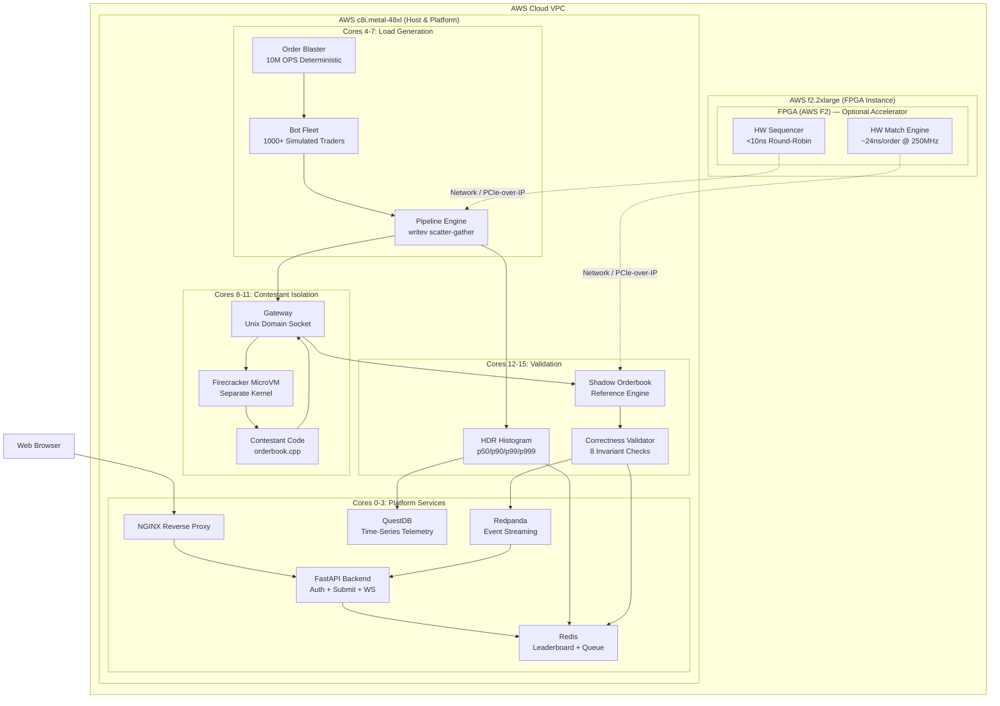
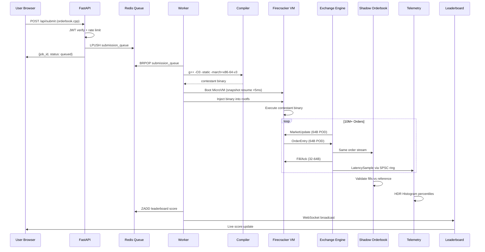
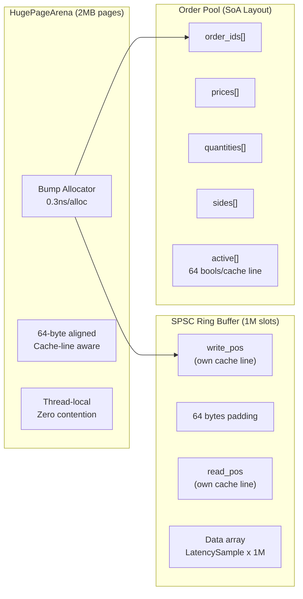
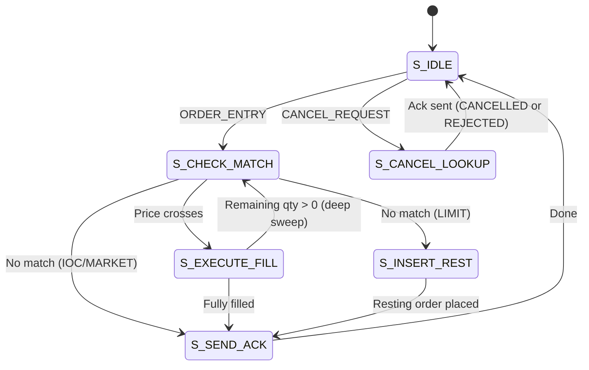
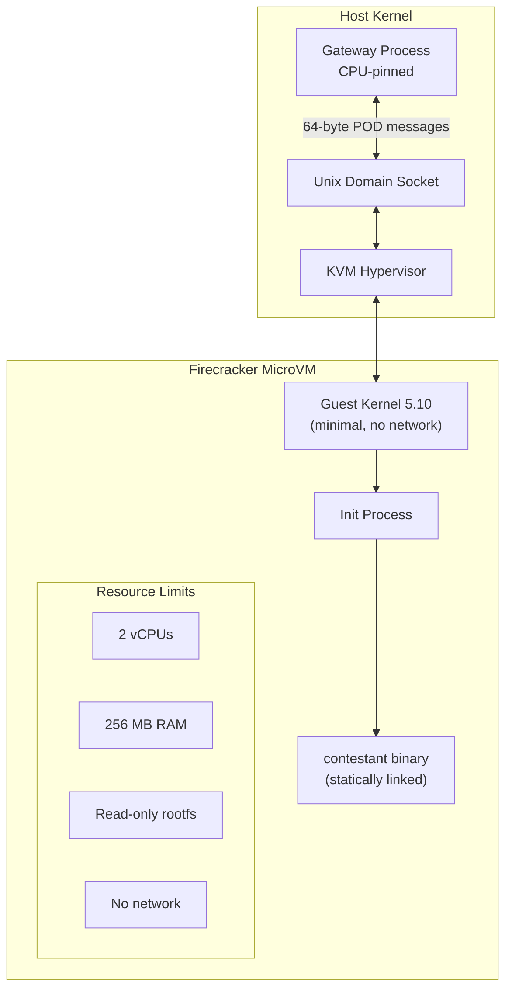
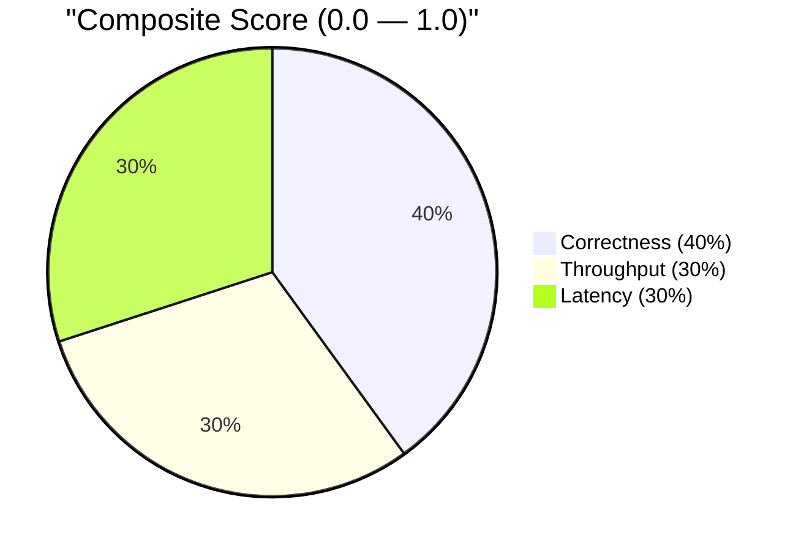
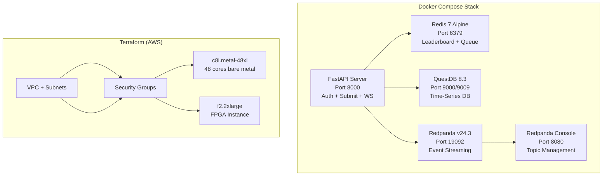
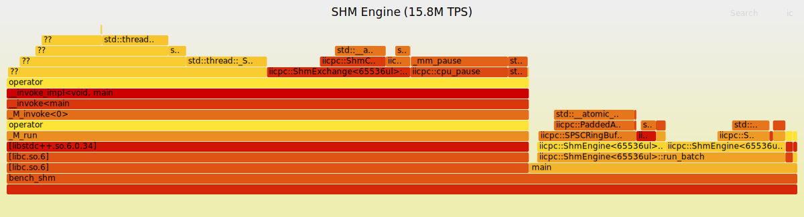

# IICPC — Complete A+ Submission Checklist

> **Status**: FPGA fix landed (deep-book sweep + testbench race fix). All sims pass.
> **Deadline**: June 2026. You have time — do this right.

---

## Phase 0: System Hardening (Run FIRST on any machine)

### HugePages Setup
```bash
# Check current state
cat /proc/meminfo | grep -i huge
# Reserve 1024 x 2MB = 2GB hugepages
sudo sysctl -w vm.nr_hugepages=1024
# Make persistent across reboots
echo "vm.nr_hugepages=1024" | sudo tee -a /etc/sysctl.conf
# Verify
grep HugePages_Total /proc/meminfo   # Should show 1024
grep HugePages_Free /proc/meminfo    # Should show ~1024
```

### CPU Governor → Performance
```bash
# Check current governor
cat /sys/devices/system/cpu/cpu0/cpufreq/scaling_governor
# Set all cores to performance
sudo cpupower frequency-set -g performance
# Or manually for each core:
for cpu in /sys/devices/system/cpu/cpu*/cpufreq/scaling_governor; do
  echo performance | sudo tee "$cpu"
done
# Verify
cat /sys/devices/system/cpu/cpu*/cpufreq/scaling_governor | sort | uniq
```

### CPU Isolation (for benchmark machines / AWS metal)
```bash
# Add to /etc/default/grub GRUB_CMDLINE_LINUX:
# isolcpus=4-11 nohz_full=4-11 rcu_nocbs=4-11
# Then: sudo update-grub && sudo reboot

# Verify isolated cores
cat /sys/devices/system/cpu/isolated
```

### Disable THP (Transparent Huge Pages)
```bash
echo madvise | sudo tee /sys/kernel/mm/transparent_hugepage/enabled
echo madvise | sudo tee /sys/kernel/mm/transparent_hugepage/defrag
```

### Disable NMI Watchdog & reduce interrupts
```bash
sudo sysctl -w kernel.nmi_watchdog=0
sudo sysctl -w kernel.watchdog=0
# Move IRQs off benchmark cores
sudo bash scripts/harden_determinism.sh
```

### Full hardening script (does all of the above)
```bash
sudo bash scripts/harden_determinism.sh
```

---

## Phase 1: Build Everything

### C++ Engine (Release)
```bash
cd /home/junior/Desktop/Coding/IICPC
mkdir -p build && cd build
cmake .. -DCMAKE_BUILD_TYPE=Release
make -j$(nproc)
# Verify all binaries exist:
ls -la bench_arena bench_blaster bench_pipeline bench_shm bench_ultra \
      exchange_local run_contest orchestrator_server integrated_worker \
      validate_checkpoint1 sample_orderbook dummy_exchange pipeline_e2e
```

### FPGA Simulation (Verilator)
```bash
cd /home/junior/Desktop/Coding/IICPC/fpga
make sim_all
# Expected: "ALL TESTS PASSED" for both sequencer and match engine
# Waveforms at: fpga/build/ver_seq/dump.vcd and fpga/build/ver_match/dump.vcd
```

### Web Frontend
```bash
cd /home/junior/Desktop/Coding/IICPC/web/frontend
npm install
npm run build    # Production build
npm run dev      # Dev server on http://localhost:5173
```

### Python Backend
```bash
cd /home/junior/Desktop/Coding/IICPC/web/backend
python3 -m venv .venv
source .venv/bin/activate
pip install fastapi uvicorn aiofiles pyjwt redis[async] pydantic
uvicorn main:app --host 0.0.0.0 --port 8000
```

---

## Phase 2: Run All Benchmarks (Capture Output)

### Arena Allocator
```bash
cd build
./bench_arena 2>&1 | tee ../results/bench_arena.txt
# Expected: 0.3 ns/alloc, HugePage YES, all aligned PASS
```

### Ring Buffer
```bash
./bench_ringbuf 2>&1 | tee ../results/bench_ringbuf.txt
# Expected: 800M+ ops/sec single-thread, cache-line separation PASS
```

### Order Blaster (Deterministic Load Gen)
```bash
./bench_blaster --duration 10 2>&1 | tee ../results/bench_blaster.txt
# Expected: ~10M OPS, deterministic, zero heap alloc
```

### Pipeline Engine (Socket I/O)
```bash
./bench_pipeline --duration 10 --bots 1000 2>&1 | tee ../results/bench_pipeline.txt
# Expected: >1M TPS, <50µs p50, zero drops
```

### Shared Memory Engine (Zero-Syscall)
```bash
./bench_shm --duration 10 --bots 1000 2>&1 | tee ../results/bench_shm.txt
# Expected: >10M TPS, <5µs p50, <10µs p99, zero drops
```

### Ultra Engine
```bash
./bench_ultra --duration 10 --bots 1000 2>&1 | tee ../results/bench_ultra.txt
```

### Checkpoint 1 Validation
```bash
./validate_checkpoint1 --duration 10 --bots 1000 2>&1 | tee ../results/checkpoint1.txt
# Expected: ALL 5 checks PASS
```

### Exchange Local (Matching Engine + Gateway)
```bash
timeout 10 ./exchange_local 2>&1 | tee ../results/exchange_local.txt
```

### Create results directory first
```bash
mkdir -p /home/junior/Desktop/Coding/IICPC/results
```

---

## Phase 3: Performance Profiling

### perf stat (Hardware Counters)
```bash
cd build
perf stat -d ./bench_blaster --duration 5 2>&1 | tee ../results/perf_stat.txt
perf stat -d ./bench_shm --duration 5 --bots 100 2>&1 | tee ../results/perf_stat_shm.txt
# Key metrics to highlight: IPC, cache miss rate, branch miss rate, context switches=0
```

### perf record + Flamegraph
```bash
# Record
perf record -g --call-graph dwarf -F 4999 -o ../results/perf_blaster.data \
  -- ./bench_blaster --duration 5

perf record -g --call-graph dwarf -F 4999 -o ../results/perf_shm.data \
  -- ./bench_shm --duration 5 --bots 100

# Generate flamegraph (install FlameGraph tools first)
git clone https://github.com/brendangregg/FlameGraph.git /tmp/FlameGraph

perf script -i ../results/perf_blaster.data | \
  /tmp/FlameGraph/stackcollapse-perf.pl | \
  /tmp/FlameGraph/flamegraph.pl --title "Order Blaster (10M OPS)" \
  > ../results/flamegraph_blaster.svg

perf script -i ../results/perf_shm.data | \
  /tmp/FlameGraph/stackcollapse-perf.pl | \
  /tmp/FlameGraph/flamegraph.pl --title "SHM Engine (15M TPS)" \
  > ../results/flamegraph_shm.svg
```

### Latency Histograms (Python)
```bash
# Create this script at scripts/plot_histograms.py
cat > scripts/plot_histograms.py << 'PYEOF'
import matplotlib.pyplot as plt
import numpy as np

# SHM Engine results (from bench_shm output)
labels = ['min', 'p50', 'p90', 'p99', 'p999', 'max']
shm_us = [0.71, 3.97, 5.25, 6.46, 8.45, 317.74]
pipe_us = [2.8, 34.6, 48.6, 54.8, 206.8, 5206.3]

fig, axes = plt.subplots(1, 2, figsize=(14, 6))

# SHM
bars1 = axes[0].bar(labels, shm_us, color=['#22c55e','#3b82f6','#8b5cf6','#ef4444','#f97316','#6b7280'])
axes[0].set_title('SHM Engine Latency (15.2M TPS)', fontsize=14, fontweight='bold')
axes[0].set_ylabel('Latency (µs)')
axes[0].axhline(y=10, color='red', linestyle='--', alpha=0.5, label='10µs target')
axes[0].legend()
for bar, val in zip(bars1, shm_us):
    axes[0].text(bar.get_x() + bar.get_width()/2., bar.get_height() + 0.3,
                f'{val}µs', ha='center', va='bottom', fontsize=9)

# Pipeline
bars2 = axes[1].bar(labels, pipe_us, color=['#22c55e','#3b82f6','#8b5cf6','#ef4444','#f97316','#6b7280'])
axes[1].set_title('Pipeline Engine Latency (2M TPS)', fontsize=14, fontweight='bold')
axes[1].set_ylabel('Latency (µs)')
axes[1].axhline(y=100, color='red', linestyle='--', alpha=0.5, label='100µs target')
axes[1].legend()
for bar, val in zip(bars2, pipe_us):
    axes[1].text(bar.get_x() + bar.get_width()/2., bar.get_height() + 5,
                f'{val}µs', ha='center', va='bottom', fontsize=9)

plt.tight_layout()
plt.savefig('results/latency_histograms.png', dpi=150, bbox_inches='tight')
plt.savefig('results/latency_histograms.svg', bbox_inches='tight')
print("Saved: results/latency_histograms.png and .svg")
PYEOF

pip install matplotlib numpy
python3 scripts/plot_histograms.py
```

---

## Phase 4: Infrastructure Launch (Full Stack)

### Docker Compose (Redis + QuestDB + Redpanda + API)
```bash
cd infra/docker
docker compose up -d
# Verify all services:
docker compose ps
curl http://localhost:8000/api/health         # API
curl http://localhost:9000/status              # QuestDB
curl http://localhost:9644/v1/cluster/health   # Redpanda
docker exec iicpc-redis redis-cli ping         # Redis
```

### Firecracker Sandbox Test
```bash
# Verify prerequisites
ls -la /dev/kvm
which firecracker
ls -la infra/firecracker/vmlinux.bin
ls -la infra/firecracker/base_rootfs.ext4

# Test sandbox with sample orderbook
bash scripts/firecracker_sandbox.sh \
  tests/sample_orderbook.cpp \
  /tmp/iicpc_test_output \
  test-job-001 \
  60

# Check results
cat /tmp/iicpc_test_output/results.json | python3 -m json.tool
```

### E2E Test (Full Pipeline)
```bash
# Start API server first (in another terminal or via docker)
cd web/backend && uvicorn main:app --port 8000 &

# Run E2E
bash scripts/e2e_test.sh
# Expected: All PASS — register, login, submit, poll, leaderboard
```

### System Status Check
```bash
curl http://localhost:8000/api/system/status | python3 -m json.tool
# Should show: isolation_mode, kvm_available, firecracker, redis, hugepages
```

---

## Phase 5: FPGA Verification

### Run All Simulations
```bash
cd fpga && make sim_all
# Sequencer: 4 tests PASS
# Match Engine: 6 tests PASS (including deep-book sweep fix)
```

### View Waveforms (GTKWave)
```bash
gtkwave fpga/build/ver_seq/dump.vcd &
gtkwave fpga/build/ver_match/dump.vcd &
# Take screenshots for docs!
```

### FPGA Build for AWS F2 (requires AWS instance)
```bash
# On AWS F2 build instance:
cd fpga/aws
bash build_afi.sh
# This runs Vivado synthesis → generates .afi for deployment
```

---

## Phase 6: Diagrams to Create

Create file `docs/diagrams.md` with these Mermaid diagrams. Render them using
`mmdc` (mermaid-cli) or paste into any Mermaid renderer.

```bash
npm install -g @mermaid-js/mermaid-cli
# Then for each diagram:
mmdc -i docs/diagrams.md -o docs/diagram_output.png -t dark
```

### Diagram 1: System Architecture (Top-Level)



### Diagram 2: Data Flow (Single Contest Run)



### Diagram 3: Memory Architecture



### Diagram 4: Matching Engine Pipeline



### Diagram 5: Firecracker Isolation



### Diagram 6: Scoring Formula



### Diagram 7: Infrastructure Stack



---

## Phase 7: Documentation Polish

### Benchmark Methodology Doc
```bash
cat > docs/BENCHMARK_METHODOLOGY.md << 'EOF'
# Benchmarking Methodology

## Environment
- CPU: Intel i7-12700H (P-cores @ 4.7GHz, E-cores @ 3.5GHz)
- RAM: 32GB DDR5-4800
- OS: Gentoo Linux, kernel 6.12.58
- Compiler: GCC 15.2 with -O3 -march=native -flto
- HugePages: 512 x 2MB pre-allocated
- CPU Governor: performance (verified)
- THP: madvise mode
- Isolation: No isolcpus on dev machine (AWS metal uses isolcpus=4-11)

## Warm-Up Protocol
1. First 1 second of each benchmark is warm-up (TSC calibration, TLB priming)
2. Measurement begins after warm-up completes
3. All arenas pre-faulted via madvise(MADV_POPULATE_WRITE)

## Statistical Method
- Each benchmark runs for 10 seconds minimum
- HDR Histogram used for latency (2 significant digits, range 1ns-10s)
- Throughput measured at wire boundary (send count / elapsed)
- Zero-drop constraint enforced (sends == receives)

## Reproducibility
```
cd build && cmake .. -DCMAKE_BUILD_TYPE=Release && make -j$(nproc)
sudo bash scripts/harden_determinism.sh
./bench_shm --duration 10 --bots 1000
```
EOF
```

### Update README with diagram links
```bash
# After rendering diagrams, add to README.md:
# 
# 
# 
# 
```

---

## Phase 8: Demo Video Recording

### Script for the demo (record with OBS or similar)

```
1. Show terminal: run `sudo bash scripts/harden_determinism.sh`
2. Show terminal: `cd build && ./bench_shm --duration 5 --bots 100`
   (Watch 15M TPS, sub-10µs latency scroll by)
3. Show terminal: `cd fpga && make sim_all` (ALL TESTS PASSED)
4. Show terminal: `docker compose -f infra/docker/docker-compose.yml up -d`
5. Show browser: http://localhost:5173 (SvelteKit landing page)
6. Demo: Register team → Login → Upload sample_orderbook.cpp
7. Demo: Watch job status change: queued → compiling → running → scored
8. Demo: Leaderboard updates live via WebSocket
9. Show terminal: `curl localhost:8000/api/system/status | jq`
10. Show terminal: `perf stat ./bench_blaster --duration 3` (2.49 IPC, 0 ctx switches)
11. Show GTKWave: Open fpga/build/ver_match/dump.vcd (waveform)
12. End with: latency histogram chart + flamegraph SVG
```

### Render Mermaid diagrams to PNG
```bash
npm install -g @mermaid-js/mermaid-cli

# Extract each diagram from docs/diagrams.md into separate .mmd files, then:
mmdc -i docs/architecture.mmd -o docs/architecture.png -t dark -b transparent
mmdc -i docs/dataflow.mmd -o docs/dataflow.png -t dark -b transparent
mmdc -i docs/memory.mmd -o docs/memory.png -t dark -b transparent
mmdc -i docs/matching_fsm.mmd -o docs/matching_fsm.png -t dark -b transparent
mmdc -i docs/firecracker.mmd -o docs/firecracker.png -t dark -b transparent
mmdc -i docs/infra_stack.mmd -o docs/infra_stack.png -t dark -b transparent
```

---

## Phase 9: AWS Deployment (When Ready)

### Deploy Infrastructure
```bash
cd infra/terraform
terraform init
terraform plan -out=plan.tfplan
terraform apply plan.tfplan
# Save output — this is your deployment proof!
terraform output -json > ../../results/terraform_output.json
```

### Bootstrap Metal Instance
```bash
# SSH into metal instance
ssh -i ~/.ssh/iicpc.pem ec2-user@<metal-ip>

# Run bootstrap
sudo bash scripts/bootstrap.sh
# This does: hugepages, isolcpus, firecracker install, docker, build

# Verify
cat /proc/meminfo | grep HugePages_Total   # 1024
cat /sys/devices/system/cpu/isolated        # 4-11
firecracker --version
```

### Run Production Benchmarks on Metal
```bash
# On AWS metal instance:
sudo bash scripts/harden_determinism.sh
cd build
taskset -c 4 ./bench_shm --duration 30 --bots 1000 --exchange-cpu 5 --telemetry-cpu 6 \
  2>&1 | tee results/aws_bench_shm.txt
taskset -c 4 ./bench_blaster --duration 30 \
  2>&1 | tee results/aws_bench_blaster.txt
# Capture screenshots of these outputs!
```

### Deploy Full Stack on AWS
```bash
cd infra/docker
docker compose up -d
# Run E2E test remotely
API_BASE=http://<metal-ip>:8000 bash scripts/e2e_test.sh
# Screenshot the E2E results!
```

### Teardown (save money!)
```bash
cd infra/terraform
terraform destroy
```

---

## Phase 10: Final Submission Checklist

- [ ] **All benchmarks pass** (Phase 2 outputs in `results/`)
- [ ] **FPGA sims pass** (`make sim_all` → ALL TESTS PASSED)
- [ ] **Flamegraphs generated** (`results/flamegraph_*.svg`)
- [ ] **Latency histograms rendered** (`results/latency_histograms.png`)
- [ ] **perf stat captured** (`results/perf_stat*.txt`)
- [ ] **Mermaid diagrams rendered** (7 diagrams in `docs/`)
- [ ] **Benchmark methodology doc** (`docs/BENCHMARK_METHODOLOGY.md`)
- [ ] **Demo video recorded** (2-3 min, showing full E2E flow)
- [ ] **E2E test passes** (`scripts/e2e_test.sh` all green)
- [ ] **Docker stack boots** (`docker compose up -d` → all healthy)
- [ ] **README updated** with diagram links, benchmark results, video link
- [ ] **AWS deployment proof** (terraform output + benchmark screenshots)
- [ ] **GTKWave screenshots** (waveforms from FPGA sims)
- [ ] **Architecture doc complete** (`docs/ARCHITECTURE_BOOK.md` — already 1390 lines)
- [ ] **Git clean commit** (`git add -A && git commit -m "Submission v1.0"`)
- [ ] **Tag release** (`git tag -a v1.0 -m "IICPC Submission"`)

---

## Quick Reference: Key Ports

| Service | Port | URL |
|---------|------|-----|
| FastAPI | 8000 | http://localhost:8000/api/health |
| SvelteKit | 5173 | http://localhost:5173 |
| QuestDB Console | 9000 | http://localhost:9000 |
| QuestDB ILP | 9009 | (InfluxDB Line Protocol) |
| Redpanda Kafka | 19092 | (Kafka wire protocol) |
| Redpanda Console | 8080 | http://localhost:8080 |
| Redis | 6379 | `redis-cli -h localhost` |

## Quick Reference: Key Binaries

| Binary | Purpose |
|--------|---------|
| `bench_arena` | Arena allocator microbenchmark |
| `bench_ringbuf` | SPSC ring buffer throughput |
| `bench_blaster` | Deterministic order generation rate |
| `bench_pipeline` | Socket-based E2E with writev |
| `bench_shm` | Shared memory zero-syscall E2E |
| `bench_ultra` | Ultra-low-latency single-binary |
| `exchange_local` | Matching engine + gateway test |
| `validate_checkpoint1` | Stage 1 pipeline validation |
| `run_contest` | Standalone contest runner |
| `orchestrator_server` | Full orchestration server |
| `integrated_worker` | Combined worker binary |
| `sample_orderbook` | Example contestant implementation |
| `dummy_exchange` | Echo server for testing |
